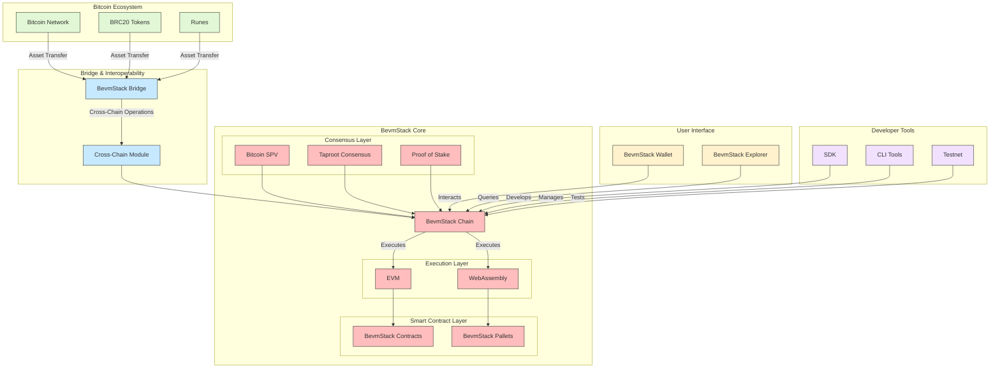
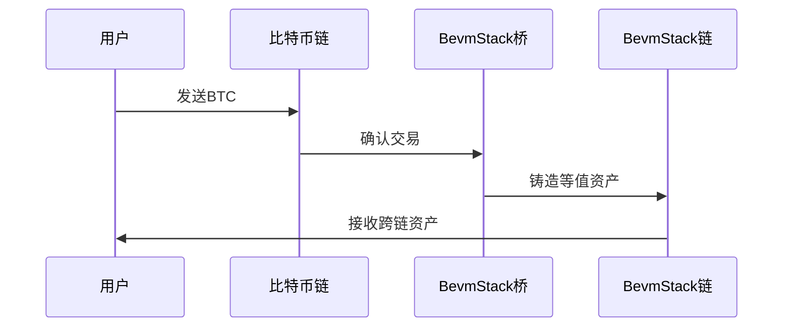
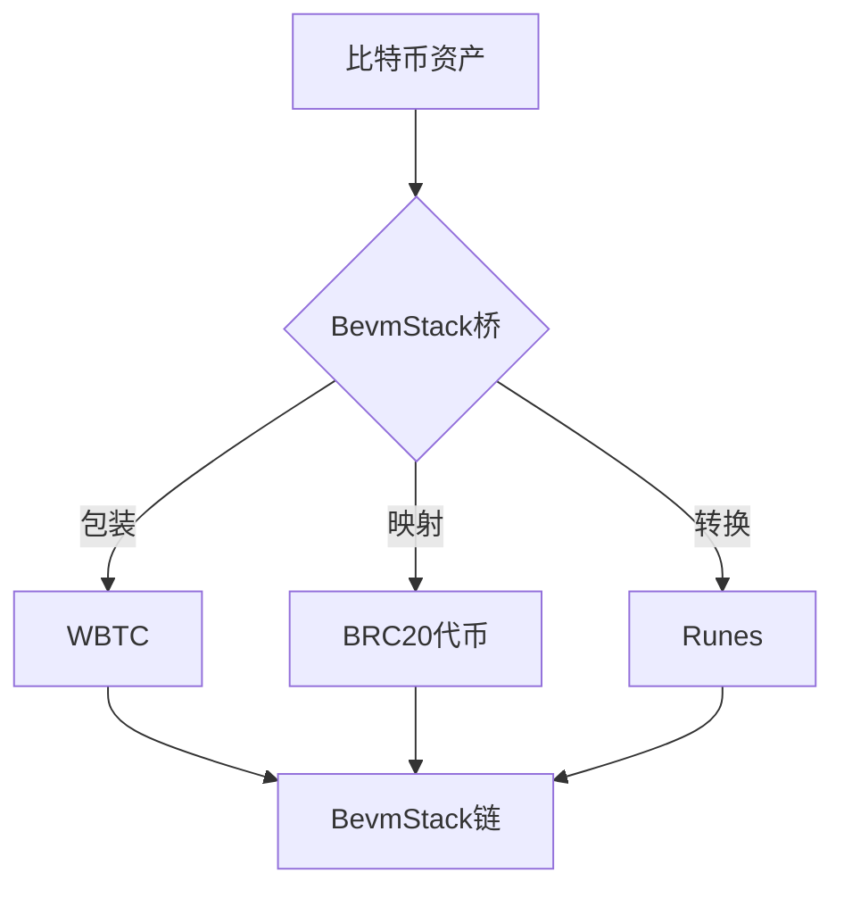

# BevmStack技术架构

## 1. 引言

BevmStack是一个模块化、开源的区块链技术栈，旨在实现Bitcoin资产与以太坊虚拟机（EVM）兼容的智能合约功能的无缝集成。它借鉴了OP Stack的设计理念，提供了一套完整的工具和组件，用于构建、部署和操作与比特币生态系统紧密集成的可扩展区块链网络。

BevmStack的核心目标是：

* 实现比特币资产的智能合约功能
* 提供高吞吐量和低延迟的交易处理
* 保持与以太坊生态系统的兼容性
* 确保网络的安全性和去中心化

## 2. 系统架构

下图详细展示了BevmStack生态系统的各个组件及其相互关系：

该架构图清晰地展示了BevmStack的多层次结构，包括：

1. **Bitcoin生态系统层**：包括比特币网络、BRC20代币和Runes等。
2. **BevmStack核心层**：
   - 共识层：整合了比特币SPV、Taproot共识和PoS共识。
   - 执行层：包含EVM和WebAssembly虚拟机。
   - 智能合约层：由BevmStack合约和Pallets组成。
3. **桥接与互操作性层**：实现跨链资产转移和操作。
4. **用户界面层**：包括BevmStack钱包和区块浏览器。
5. **开发者工具层**：提供SDK、CLI工具和测试网。

## 3. 核心技术组件

### 3.1 BevmStack链

BevmStack链是整个生态系统的基础，它支持多种比特币资产作为交易燃料，并提供EVM兼容的智能合约环境。

#### 3.1.1 混合共识机制

BevmStack采用创新的混合共识机制，结合了以下技术：

- **比特币SPV（简化支付验证）**：实现与比特币主链的轻量级验证，确保跨链操作的安全性。
- **Taproot共识**：提高交易隐私性和可扩展性，增强整体网络性能。
- **PoS（权益证明）共识**：确保网络的高效率和可持续性，同时降低能源消耗。

这种混合共识机制不仅保证了网络的安全性和效率，还实现了与比特币网络的紧密集成。

#### 3.1.2 双虚拟机架构

BevmStack链支持双虚拟机架构，这是其技术创新的另一个关键方面：

- **WebAssembly（WASM）虚拟机**：执行系统级合约，管理核心区块链功能。WASM的高性能和跨平台特性使其成为理想的系统级合约执行环境。
- **EVM虚拟机**：提供以太坊兼容的智能合约执行环境，支持丰富的DApp生态系统。

这种双虚拟机架构使BevmStack能够同时获得系统级的高性能和用户级的广泛兼容性。

### 3.2 BevmStack桥

BevmStack桥是连接比特币网络和BevmStack链的关键组件。它实现了资产的跨链转移和互操作性。以下序列图展示了其工作流程：

这个过程确保了资产在不同链间的安全、高效转移，为用户提供了无缝的跨链体验。

### 3.3 智能合约生态系统

BevmStack的智能合约生态系统由两个主要部分组成：

1. **BevmStack合约**：EVM兼容的智能合约，用于管理跨链资产和开发DApp。
2. **BevmStack Pallets**：基于WebAssembly的智能合约，管理核心区块链系统功能。

这种双层智能合约结构使BevmStack能够同时提供高性能的系统管理和灵活的应用开发环境。

## 4. 关键技术创新

### 4.1 多资产燃料机制

BevmStack支持多种比特币资产作为交易燃料，这一创新大大增加了比特币资产的实用性：

这种机制不仅提高了网络的灵活性，还为比特币生态系统中的各种资产提供了新的应用场景。

### 4.2 跨链资产管理

通过创新的跨链桥技术，BevmStack实现了比特币资产到EVM兼容环境的无缝转换：

这种跨链资产管理机制极大地增强了比特币资产的流动性和使用场景。

### 4.3 安全性考虑

BevmStack采用多层安全架构确保网络安全：

这种多层安全架构确保了网络在各个层面都得到充分的保护，从底层协议到应用层合约。

## 5. 开发者工具与生态系统

为了支持活跃的开发者社区，BevmStack提供了丰富的开发工具：

- 多语言SDK支持
- 命令行界面（CLI）工具
- 智能合约开发框架
- 测试网络和水龙头服务

这些工具大大降低了开发者的入门门槛，促进了BevmStack生态系统的快速发展。

## 6. 结论

BevmStack代表了区块链技术的重要进步，通过创新的方式将比特币的安全性与EVM的灵活性相结合。其独特的架构设计、多资产支持和跨链能力为区块链技术开辟了新的可能性。随着技术的不断成熟和生态系统的扩展，BevmStack有望成为推动区块链技术进步和应用落地的关键力量。

通过整合比特币的网络效应和智能合约的灵活性，BevmStack为去中心化金融（DeFi）、非同质化代币（NFT）和其他创新应用提供了强大的基础设施。未来，随着更多开发者和企业加入BevmStack生态系统，我们有理由期待看到更多突破性的区块链应用和解决方案的出现。
