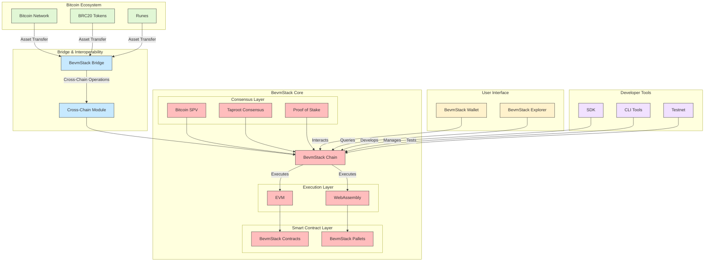
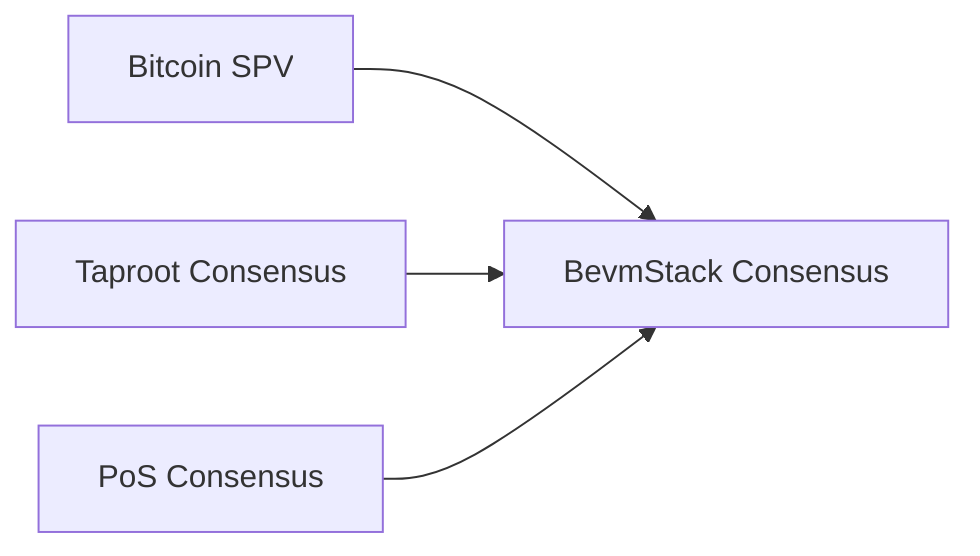
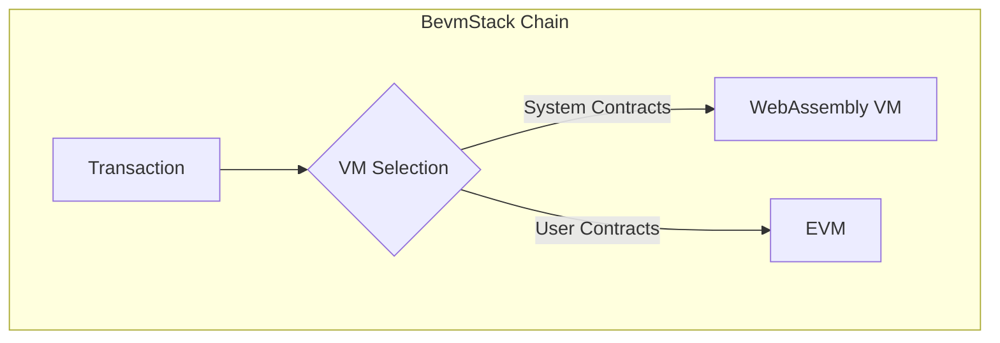
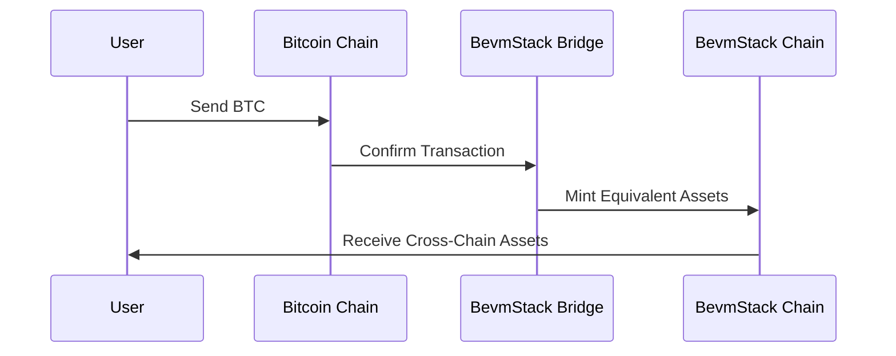
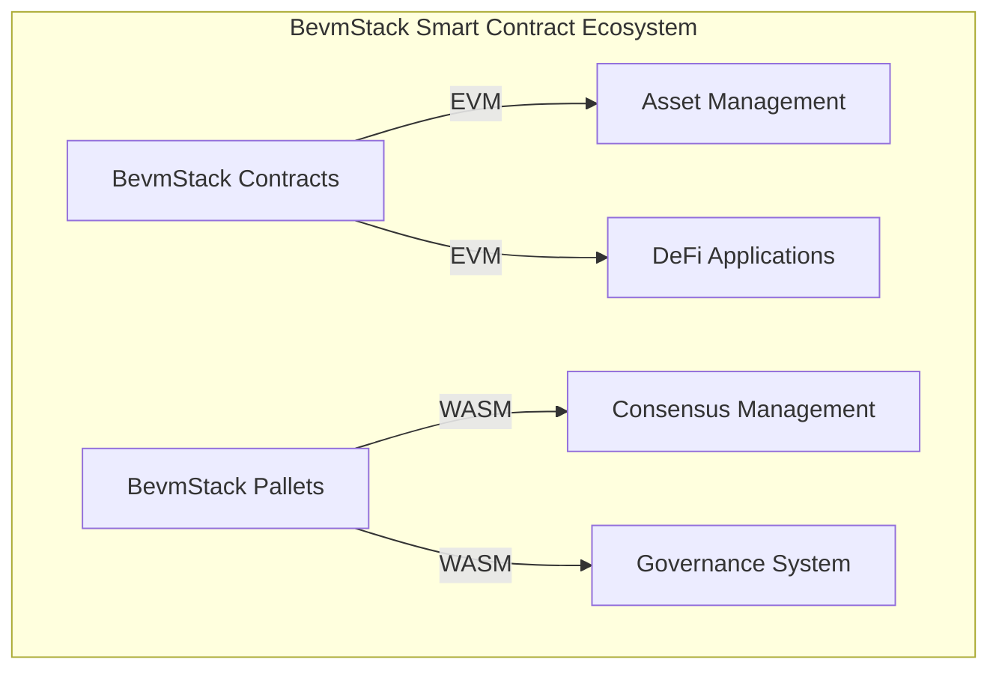
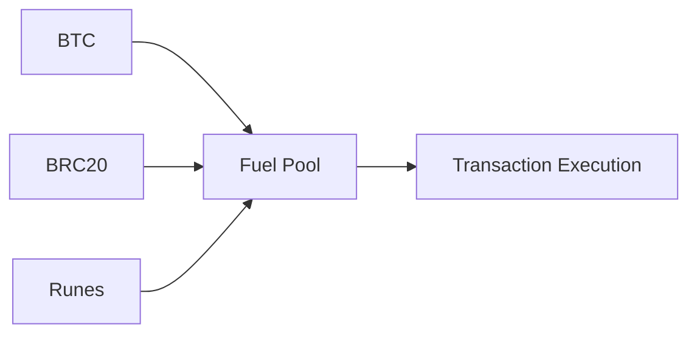
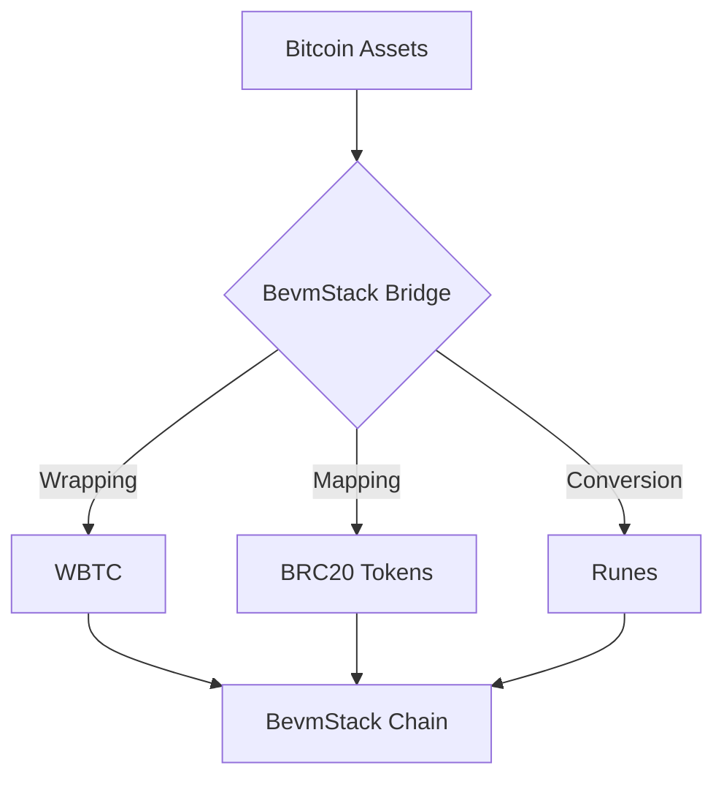
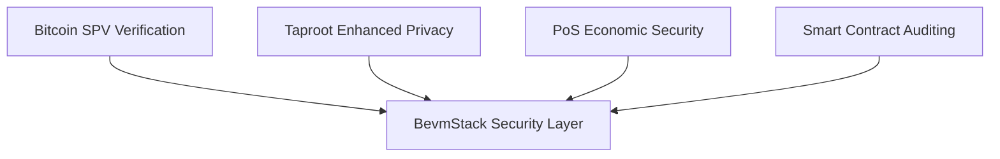

# BevmStack Technical Architecture

## 1. Introduction

BevmStack is a modular, open-source blockchain technology stack designed to seamlessly integrate Bitcoin assets with Ethereum Virtual Machine (EVM) compatible smart contract functionality. Drawing inspiration from the OP Stack design philosophy, it provides a comprehensive set of tools and components for building, deploying, and operating scalable blockchain networks that are tightly integrated with the Bitcoin ecosystem.

### 1.1 Key Features

- 🔗 Seamless Bitcoin and EVM integration
- 🚀 High-throughput and low-latency transaction processing
- 💡 Multi-asset fuel mechanism
- 🌉 Advanced cross-chain asset management
- 🛡️ Multi-layered security architecture
- 🧰 Rich developer tools and SDK support

## 2. System Architecture

The following diagram illustrates the various components of the BevmStack ecosystem and their interrelationships:

The architecture diagram clearly shows the multi-layered structure of BevmStack, including:

1. **Bitcoin Ecosystem Layer**: Encompasses the Bitcoin network, BRC20 tokens, and Runes.
2. **BevmStack Core Layer**:
   - Consensus Layer: Integrates Bitcoin SPV, Taproot consensus, and PoS consensus.
   - Execution Layer: Contains EVM and WebAssembly virtual machines.
   - Smart Contract Layer: Composed of BevmStack contracts and Pallets.
3. **Bridge and Interoperability Layer**: Enables cross-chain asset transfer and operations.
4. **User Interface Layer**: Includes BevmStack wallet and block explorer.
5. **Developer Tools Layer**: Provides SDK, CLI tools, and testnet.

## 3. Core Technical Components

### 3.1 BevmStack Chain

The BevmStack Chain is the foundation of the entire ecosystem, supporting multiple Bitcoin assets as transaction fuel and providing an EVM-compatible smart contract environment.

#### 3.1.1 Hybrid Consensus Mechanism

BevmStack employs an innovative hybrid consensus mechanism, combining the following technologies:

- **Bitcoin SPV (Simplified Payment Verification)**: Implements lightweight verification with the Bitcoin main chain, ensuring the security of cross-chain operations.
- **Taproot Consensus**: Enhances transaction privacy and scalability, improving overall network performance.
- **PoS (Proof of Stake) Consensus**: Ensures network efficiency and sustainability while reducing energy consumption.

This hybrid consensus mechanism not only guarantees network security and efficiency but also achieves tight integration with the Bitcoin network.

#### 3.1.2 Dual Virtual Machine Architecture

The BevmStack Chain supports a dual virtual machine architecture, which is another key aspect of its technological innovation:

- **WebAssembly (WASM) Virtual Machine**: Executes system-level contracts, managing core blockchain functionalities. WASM's high performance and cross-platform characteristics make it an ideal environment for executing system-level contracts.
- **EVM**: Provides an Ethereum-compatible smart contract execution environment, supporting a rich DApp ecosystem.

This dual virtual machine architecture allows BevmStack to achieve both system-level high performance and user-level wide compatibility.

### 3.2 BevmStack Bridge

The BevmStack Bridge is a key component connecting the Bitcoin network and the BevmStack Chain. It enables cross-chain asset transfer and interoperability. The following sequence diagram illustrates its workflow:

This process ensures secure and efficient asset transfer between different chains, providing users with a seamless cross-chain experience.

### 3.3 Smart Contract Ecosystem

The BevmStack smart contract ecosystem consists of two main parts:

1. **BevmStack Contracts**: EVM-compatible smart contracts for managing cross-chain assets and developing DApps.
2. **BevmStack Pallets**: WebAssembly-based smart contracts for managing core blockchain system functions.

This dual-layer smart contract structure allows BevmStack to provide both high-performance system management and flexible application development environments.

## 4. Key Technological Innovations

### 4.1 Multi-Asset Fuel Mechanism

BevmStack supports multiple Bitcoin assets as transaction fuel, significantly increasing the utility of Bitcoin assets:

This mechanism not only enhances network flexibility but also provides new application scenarios for various assets in the Bitcoin ecosystem.

### 4.2 Cross-Chain Asset Management

Through innovative cross-chain bridge technology, BevmStack enables seamless conversion of Bitcoin assets to EVM-compatible environments:

This cross-chain asset management mechanism greatly enhances the liquidity and use cases of Bitcoin assets.

### 4.3 Security Considerations

BevmStack adopts a multi-layered security architecture to ensure network security:

This multi-layered security architecture ensures that the network is adequately protected at all levels, from the underlying protocol to application-layer contracts.

## 5. Developer Tools and Ecosystem

To support an active developer community, BevmStack provides a rich set of development tools:

- Multi-language SDK support
- Command-line interface (CLI) tools
- Smart contract development frameworks
- Testnet and faucet services

These tools significantly lower the entry barrier for developers, promoting the rapid development of the BevmStack ecosystem.

## 6. Conclusion

BevmStack represents a significant advancement in blockchain technology, innovatively combining Bitcoin's security with EVM's flexibility. Its unique architectural design, multi-asset support, and cross-chain capabilities open up new possibilities for blockchain technology. As the technology matures and the ecosystem expands, BevmStack is poised to become a key force in driving blockchain technology progress and application deployment.

By integrating Bitcoin's network effects with the flexibility of smart contracts, BevmStack provides a powerful infrastructure for decentralized finance (DeFi), non-fungible tokens (NFTs), and other innovative applications. As more developers and enterprises join the BevmStack ecosystem, we can reasonably expect to see the emergence of more groundbreaking blockchain applications and solutions.
